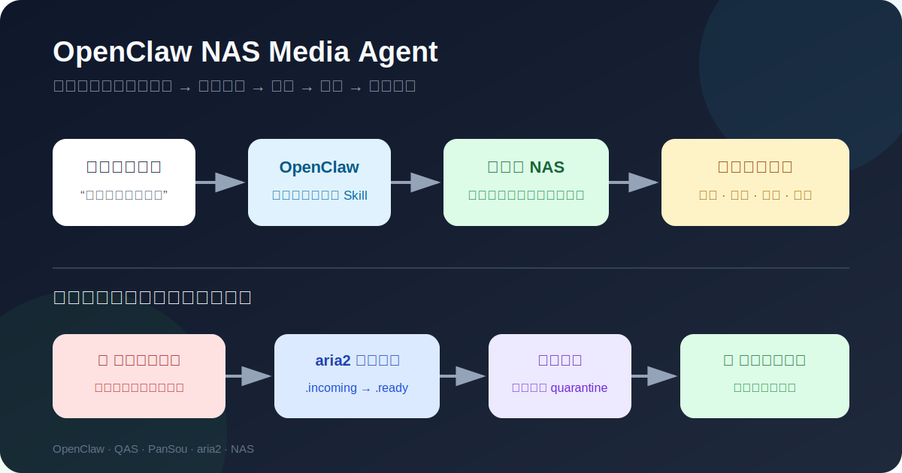
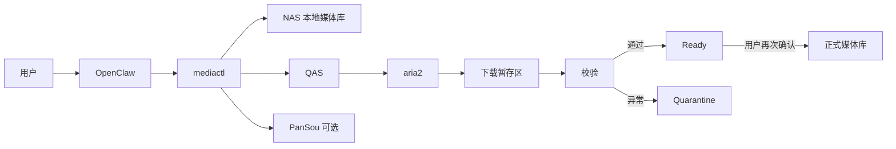

<p align="center">
  
</p>

# OpenClaw NAS Media Agent

> 用一句自然语言，让智能体完成 **NAS 本地检索 → 远端候选预览 → 用户选版 → 下载监控 → 校验 → 整理入库**。

<p align="center">
  <strong>先查本地，再找候选；先让你确认，再执行下载；先完成校验，再整理入库。</strong>
</p>

<p align="center">
  <a href="https://www.bilibili.com/video/BV1tRKB6rEsW">▶ 查看演示</a>
  ·
  <a href="#快速部署复制给-agent推荐">快速部署</a>
  ·
  <a href="#手动部署">手动部署</a>
  ·
  <a href="docs/deployment/TROUBLESHOOTING.md">故障排查</a>
</p>



## 这是什么

这不是一个“搜到就下”的脚本，而是一套面向 OpenClaw 的 NAS 影音管理 Skill。

你可以直接对智能体说：

```text
搜索《凡人修仙传》动画，先检查 NAS 本地有没有，只预览候选，不要下载。
```

```text
检查《凡人修仙传》有没有新集，只列出缺少的集数和可选版本。
```

```text
下载完成后先校验，告诉我准备整理到哪里，等我确认后再入库。
```

智能体会把 NAS 本地结果、缺失内容和远端候选分开展示，不会替你擅自选择大体积版本，也不会把下载内容直接写进正式媒体库。

## 核心能力

- **NAS 本地优先**：本地已有时，普通搜索直接停止，避免重复下载。
- **聚合候选预览**：通过 QAS 预览夸克分享，并可使用 PanSou 补充候选来源。
- **追更补集**：对电视剧和动画计算本地缺集，只展示增量候选。
- **候选规格对比**：尽量提取分辨率、HDR、编码、音频、字幕、大小、文件数和集数范围。
- **人工选版**：多个候选必须由用户通过 `candidateId` 选择，Agent 不自动挑选“最好版本”。
- **安全下载区**：新任务只进入 `.incoming`，校验成功后进入 `.ready`，异常进入 `.quarantine`。
- **确认后入库**：下载与整理是两个独立确认步骤。
- **任务管理**：查看、暂停、继续、取消和校验本项目创建的 aria2 任务。
- **受保护媒体库**：正式媒体库禁止删除、覆盖、清理和向外移动。

支持的媒体类型：`movie`、`drama`、`tv`、`anime`、`documentary`、`show`、`other`。

## 系统架构



| 组件 | 作用 | 是否必需 |
|---|---|---|
| OpenClaw | 理解自然语言、读取 Skill、调用固定 CLI | 是 |
| 本项目 `mediactl` | 流程编排、安全校验和状态管理 | 是 |
| QAS | 预览夸克分享、转存并触发下载 | 远端流程必需 |
| PanSou | 补充候选发现，不接触 Cookie、不直接下载 | 可选 |
| aria2 | 执行下载并提供 RPC 状态 | 远端流程必需 |
| ffprobe | 增强视频可读性校验 | 可选 |

## 快速部署：复制给 Agent（推荐）

这条路径适合绝大多数用户。

你只需要做一件事：**复制下面整段内容，粘贴给能够操作目标主机终端和文件的 Agent。**

可使用 Codex、Claude Code、Cursor、OpenCode、OpenCodex，或其他具备终端和文件操作能力的编码 Agent。后续只有在 Agent 询问路径、登录、扫码、验证码、冲突选择或危险操作确认时，你才需要参与。

<!-- AGENT_QUICK_DEPLOY_PROMPT_START -->
```text
请帮我在当前 NAS 或 Linux Docker 主机上完整部署这个项目：

https://github.com/Inupedia/openclaw-nas-media-agent

你需要自行完成仓库克隆或更新、环境检查、配置生成、依赖部署、OpenClaw Skill 安装、服务初始化和安全验收。

开始前必须先读取并严格遵守仓库中的以下文件：

1. AGENTS.md
2. docs/AGENT_DEPLOY.md
3. docs/deployment/QUICKSTART.md
4. docs/deployment/SECURITY.md
5. docs/deployment/EXISTING_OPENCLAW.md
6. docs/deployment/QAS_LOGIN.md
7. docs/deployment/PROXY.md
8. docs/deployment/TROUBLESHOOTING.md

执行要求：

- 必须使用仓库内置的 deploy/cli.py 部署器，不得自行编造另一套部署流程；
- 当前目标是已有 Compose 管理的 OpenClaw 环境，不要承诺或尝试从空白主机自动安装 OpenClaw 本体；
- 先执行只读发现和部署计划，确认环境后再修改系统；
- 优先复用已有 OpenClaw、QAS、PanSou、aria2、Docker 网络和挂载目录；
- 不得猜测 NAS 路径、端口、账号、密钥或冲突目标；
- 需要缺失信息时直接向我提问；
- 遇到登录、扫码、验证码、冲突选择或危险操作确认时暂停并让我处理；
- 不得在聊天、日志、报告或 Git 提交中输出 Cookie、Token、密码和 RPC Secret；
- 未经我明确确认，不执行真实下载、整理入库或破坏性操作；
- 按 deploy/cli.py 输出的 status、nextAction 和错误码持续处理可安全自动修复的问题，直到 verify --level safe 完成；
- 最后向我报告部署状态、容器状态、路径映射、人工待办、验收结果和回滚方式。

现在开始部署。
```
<!-- AGENT_QUICK_DEPLOY_PROMPT_END -->

Agent 会按照 [`AGENTS.md`](AGENTS.md) 和 [`docs/AGENT_DEPLOY.md`](docs/AGENT_DEPLOY.md) 执行仓库内置部署器，而不是临场拼装另一套脚本。它会先只读发现和生成计划，安全问题会自动处理；无法自动完成的步骤才会向你提问。

当前版本要求 OpenClaw 已经通过 Docker Compose 运行。它不会从空白主机自动安装 OpenClaw 本体。

详细说明见 [快速部署](docs/deployment/QUICKSTART.md)。

## 手动部署

适合希望自己检查并执行每一步的用户。手动路径与 Agent 快速部署使用同一套确定性部署器：

```bash
git clone https://github.com/Inupedia/openclaw-nas-media-agent.git
cd openclaw-nas-media-agent

python3 deploy/cli.py init
python3 deploy/cli.py discover
python3 deploy/cli.py plan
python3 deploy/cli.py apply --plan-id PLAN_ID --confirmed
python3 deploy/cli.py verify --level safe
```

部署器会完成：

1. 只读识别现有 OpenClaw、Docker 网络、挂载目录和依赖容器；
2. 生成 30 分钟有效的不可变部署计划；
3. 使用锁定镜像和确定性模板部署或复用 QAS、PanSou、aria2；
4. 安装 Skill，并将 OpenClaw 的执行权限收紧到固定绝对路径 `mediactl`；
5. 初始化 QAS、配置 aria2 RPC、检查 PanSou 和代理状态；
6. 自动执行无副作用的 `safe` 验收；
7. 在失败时依据事务日志执行回滚。

### 配置和密钥

`deploy/config.yaml` 是唯一普通配置源；密码、Cookie、Token 和代理地址保存在独立目录：

```text
deploy/secrets/
├── qas_webui_password
├── qas_token
├── quark_cookie
├── aria2_rpc_secret
└── pansou_proxy_url
```

部署器要求 secrets 目录权限为 `0700`、文件权限为 `0600`，并通过只读文件挂载把凭据交给 OpenClaw。计划、日志和验收报告不会保存真实密钥值。

### 常用部署命令

```bash
python3 deploy/cli.py init
python3 deploy/cli.py discover
python3 deploy/cli.py plan
python3 deploy/cli.py apply --plan-id PLAN_ID --confirmed
python3 deploy/cli.py verify --level safe
python3 deploy/cli.py verify --level full --confirmed
python3 deploy/cli.py rollback --deployment-id DEPLOYMENT_ID
```

详细文档：

- [已有 OpenClaw 模式](docs/deployment/EXISTING_OPENCLAW.md)
- [QAS 登录与初始化](docs/deployment/QAS_LOGIN.md)
- [PanSou 与代理](docs/deployment/PROXY.md)
- [安全说明](docs/deployment/SECURITY.md)
- [故障排查](docs/deployment/TROUBLESHOOTING.md)

## 演示效果

完整演示视频：**[解放双手，让智能体帮你管理 NAS 影音](https://www.bilibili.com/video/BV1tRKB6rEsW)**

一次典型对话大致如下：

```text
你：搜索《作品名》动画，先预览，不要下载。

Agent：
1. NAS 本地未发现该作品。
2. 找到 4 组有效候选：
   - 1080P / HEVC / 中英字幕 / 18.4 GB
   - 1080P / AVC / 中文字幕 / 26.1 GB
   - 4K HDR / HEVC / 中英字幕 / 73.8 GB
   - 720P / AVC / 中文字幕 / 8.7 GB
3. 当前未创建下载任务。请选择 candidateId。

你：选择第 1 个，只下载 S01E01-S01E12。

Agent：已生成下载计划，将写入下载暂存区；等待你确认执行。
```

## 用户命令示例

```text
搜索《作品名》电影资源，先预览，不要下载。
```

```text
检查《作品名》有没有新集，只列缺失集数和候选版本。
```

```text
列出当前下载任务和进度。
```

```text
校验任务 TASK_ID，先不要整理。
```

## CLI 速查

```bash
bin/mediactl check-ready
bin/mediactl search "作品名" --media-type anime
bin/mediactl search "作品名" --media-type anime --update
bin/mediactl preview CANDIDATE_ID
bin/mediactl tree CANDIDATE_ID
bin/mediactl plan download CANDIDATE_ID --node NODE_ID --media-type anime
bin/mediactl execute PLAN_ID --confirmed
bin/mediactl downloads list
bin/mediactl downloads show TASK_ID
bin/mediactl downloads pause TASK_ID
bin/mediactl downloads resume TASK_ID
bin/mediactl downloads cancel TASK_ID
bin/mediactl downloads validate TASK_ID
bin/mediactl organize plan TASK_ID
bin/mediactl organize execute PLAN_ID --confirmed
```

所有命令只输出一个 JSON 文档。Agent 应优先读取 `ok`、`terminal`、`nextAction`、`data` 和 `error`。

## 安全边界

- 正式媒体库不得直接作为下载目标。
- 受保护目录内已有内容不得删除、覆盖、清理或移出。
- 下载和入库都必须经过用户确认。
- OpenClaw 只允许执行固定绝对路径的 `mediactl`。
- 不要为排错向 Agent 开放任意 shell、`rm`、`curl`、Python 或 sudo。
- 本项目仅用于管理你拥有、制作或已获授权使用的媒体内容；请遵守所在地法律、平台条款和版权许可。

## 高级配置参考

不建议新用户从这里开始。高级方式主要用于调试部署器或适配特殊 Docker 环境。

仓库仍保留：

- `deploy/docker-compose.dependencies.yml`：渲染后的依赖栈参考；
- `.env.example`：Skill 运行时环境变量参考；
- `config/routing.json`：媒体路径与保护目录参考。

手动配置时至少需要理解以下变量：

```dotenv
QAS_BASE_URL=http://qas:5005
QAS_TOKEN=<replace-me>
PANSOU_BASE_URL=http://pansou:8888
ARIA2_RPC_URL=http://aria2:6800/jsonrpc
ARIA2_RPC_SECRET=<replace-me>
```

OpenClaw 与 aria2 必须挂载同一份主机下载目录；aria2 容器内推荐路径为 `/nas/downloads`。不要把正式媒体库直接配置成下载目录，也不要提交 `.env`、Cookie、Token、RPC Secret 或真实内网地址。

手动安装 Skill 的仓库地址：

```bash
git clone https://github.com/Inupedia/openclaw-nas-media-agent.git resource-download-agent
```

## 常见问题

### `check-ready` 报下载目录不可写

确认 `.incoming`、`.ready`、`.quarantine` 已创建，并且 OpenClaw 与 aria2 的运行用户拥有实际写权限。不要简单对整个媒体库开放 `0777`。

### aria2 能连接，但下载路径不对

确认同一个主机下载目录在 aria2 容器内映射为 `/nas/downloads`，并核对 `routing.json` 的 `aria2_root`。

### PanSou 容器正常，但没有 Telegram 候选

这通常是代理或 Telegram 网络访问问题。核心 QAS 下载链路仍可使用时，部署器会把状态标记为 `degraded`，而不是误报整个系统不可用。

### 为什么不自动选择 4K

4K、HDR 或高码率版本可能占用大量空间。项目只辅助排序，不替用户决定。

## 兼容性

- **正式验证范围**：标准 Linux Docker / Docker Compose，Python 3.10、3.11、3.12。
- **优先支持**：UGREEN UGOS。
- **可尝试适配**：群晖、威联通、TrueNAS、Unraid。
- 不同 NAS 的差异主要集中在卷路径、ACL、UID/GID、Docker UI 和网络设置；部署器会先发现、生成计划并执行写入探针。

## License

MIT License。软件按原样提供，不附带任何担保。
