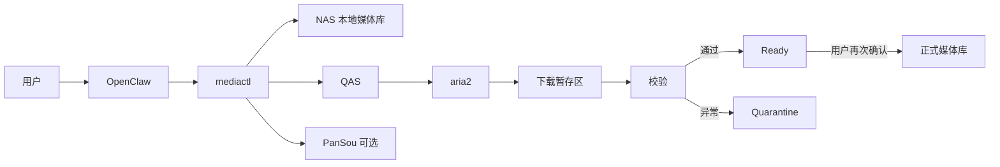

<p align="center">
  
</p>

# OpenClaw NAS Media Agent

> 用一句自然语言，让智能体完成 **NAS 本地检索 → 远端候选预览 → 用户选版 → 下载监控 → 校验 → 整理入库**。

<p align="center">
  <strong>先查本地，再找候选；先让你确认，再执行下载；先完成校验，再整理入库。</strong>
</p>

<p align="center">
  <a href="https://www.bilibili.com/video/BV1tRKB6rEsW">▶ 查看演示：解放双手，让智能体帮你管理 NAS 影音</a>
  ·
  <a href="docs/AGENT_DEPLOY.md">让 Agent 部署</a>
  ·
  <a href="deploy/docker-compose.dependencies.yml">依赖容器示例</a>
</p>


## 这是什么

这不是一个“搜到就下”的脚本，而是一套面向 OpenClaw 的 NAS 影视管理 Skill。

你可以直接对智能体说：

```text
搜索《凡人修仙传》动画，先检查 NAS 本地有没有，只预览候选，不要下载。
```

```text
检查《凡人修仙传》有没有新集，只列出缺少的集数和可选版本。
```

```text
下载任务完成后先校验，告诉我准备整理到哪里，等我确认后再入库。
```

智能体会把本地结果、缺失内容和远端候选分开展示，不会替你擅自选择大体积版本，也不会把文件直接写进正式媒体库。

## 演示效果

完整演示视频：**[解放双手，让智能体帮你管理 NAS 影音](https://www.bilibili.com/video/BV1tRKB6rEsW)**

一次典型对话大致如下：

```text
你：搜索《作品名》动画，先预览，不要下载。

Agent：
1. NAS 本地未发现该作品。
2. 找到 4 组有效候选：
   - 1080P / HEVC / 中英字幕 / 18.4 GB
   - 1080P / AVC / 中文字幕 / 26.1 GB
   - 4K HDR / HEVC / 中英字幕 / 73.8 GB
   - 720P / AVC / 中文字幕 / 8.7 GB
3. 当前未创建下载任务。请选择 candidateId。

你：选择第 1 个，只下载 S01E01-S01E12。

Agent：已生成下载计划，将写入下载暂存区；等待你确认执行。
```

## 核心能力

- **NAS 本地优先**：本地已有时，普通搜索直接停止，避免重复下载。
- **追更补集**：对电视剧和动画计算本地缺集，只展示增量候选。
- **候选规格对比**：尽量提取分辨率、HDR、编码、音频、字幕、大小、文件数与集数范围。
- **人工选版**：多个候选必须由用户选择，Agent 不自动挑选“最好版本”。
- **安全下载区**：新任务只进入 `.incoming`，校验成功后进入 `.ready`，异常进入 `.quarantine`。
- **确认后入库**：下载与整理是两个独立确认步骤。
- **任务管理**：查看、暂停、继续、取消和校验本项目创建的 aria2 任务。
- **受保护媒体库**：正式媒体库禁止删除、覆盖、清理和向外移动。

支持的媒体类型：`movie`、`drama`、`tv`、`anime`、`documentary`、`show`、`other`。

## 系统架构



各组件职责：

| 组件 | 作用 | 是否必需 |
|---|---|---|
| OpenClaw | 理解自然语言、读取 Skill、调用固定 CLI | 是 |
| 本项目 `mediactl` | 流程编排、安全校验、状态管理 | 是 |
| QAS | 预览夸克分享、转存并触发下载 | 远端流程必需 |
| PanSou | 补充候选发现，不接触 Cookie、不直接下载 | 可选 |
| aria2 | 执行真实下载并提供 RPC 状态 | 远端流程必需 |
| ffprobe | 增强视频可读性校验 | 可选 |

## 最快安装方式：把项目交给 Agent

将下面整段发给运行在 NAS 上、具有 Docker 管理权限的 Agent：

```text
请部署这个项目：
https://github.com/Inupedia/openclaw-nas-media-agent

必须先阅读：
- README.md
- docs/AGENT_DEPLOY.md
- SKILL.md
- config/routing.json
- deploy/docker-compose.dependencies.yml

请分两个阶段执行：

阶段 A：只检查，不修改
1. 识别 NAS 类型、CPU 架构、Docker Compose 版本和 OpenClaw workspace。
2. 检查 QAS、PanSou、aria2 是否已经存在，避免重复部署。
3. 请我确认下载目录、正式影视库、临时影视库的真实主机路径。
4. 输出拟采用的容器网络、端口、卷挂载、环境变量和回滚方案。
5. 不得输出 Cookie、Token、RPC Secret 或完整内网地址。

阶段 B：我确认后再部署
1. 将项目安装到 OpenClaw workspace/skills/resource-download-agent。
2. 缺失的依赖容器参考 deploy/docker-compose.dependencies.yml 部署；已有服务优先复用。
3. 让 OpenClaw 和 aria2 挂载同一个主机下载目录：
   - OpenClaw 内路径与 routing.json 的 agent_root 一致；
   - aria2 内固定映射为 /nas/downloads。
4. 根据真实路径修改 config/routing.json，不得照搬示例卷名。
5. 配置 QAS_BASE_URL、QAS_TOKEN、PANSOU_BASE_URL、ARIA2_RPC_URL、ARIA2_RPC_SECRET 和 RESOURCE_AGENT_STATE_DB。
6. OpenClaw exec 使用 allowlist，只允许本项目 bin/mediactl 的固定绝对路径。
7. 正式媒体库不得作为下载目标，不得删除、覆盖或清理已有内容。
8. 运行单元测试、mediactl check-ready 和一次“只预览、不下载”的搜索验收。
9. 最终报告安装路径、容器状态、挂载对应关系、测试结果、备份和回滚命令。
```

更完整的机器执行规则见 **[Agent 部署手册](docs/AGENT_DEPLOY.md)**。

## 手动部署

### 1. 准备依赖容器

仓库提供了一个可复制修改的依赖栈：

```bash
mkdir -p /volume1/docker/openclaw-media
cd /volume1/docker/openclaw-media

curl -O https://raw.githubusercontent.com/Inupedia/openclaw-nas-media-agent/main/deploy/docker-compose.dependencies.yml
curl -O https://raw.githubusercontent.com/Inupedia/openclaw-nas-media-agent/main/deploy/.env.dependencies.example
cp .env.dependencies.example .env
```

修改 `.env` 中的主机目录、端口和密钥后：

```bash
docker compose -f docker-compose.dependencies.yml config
docker compose -f docker-compose.dependencies.yml up -d
docker compose -f docker-compose.dependencies.yml ps
```

> Compose 示例主要帮助 Agent 理解 QAS、PanSou 与 aria2 的关系。不同 NAS 的目录、UID/GID、网络模式和已有容器不同，部署前必须调整。

### 2. 安装 Skill

以下仅以 `/volume4/openclaw` 为例：

```bash
cd /volume4/openclaw/skills
git clone https://github.com/Inupedia/openclaw-nas-media-agent.git resource-download-agent
chmod 0755 resource-download-agent/bin/mediactl
mkdir -p /volume4/openclaw/data/resource-download-agent
```

容器内常见执行路径：

```text
/root/.openclaw/workspace/skills/resource-download-agent/bin/mediactl
```

### 3. 配置挂载

推荐路径对应关系：

| 主机目录 | OpenClaw 容器 | aria2 容器 |
|---|---|---|
| 下载目录 | 与 `agent_root` 一致 | `/nas/downloads` |
| 正式影视库 | 按原路径或统一容器路径挂载 | 无需写入 |
| 临时影视库 | 按原路径或统一容器路径挂载 | 无需写入 |
| OpenClaw workspace | `/root/.openclaw/workspace` | 无需挂载 |

关键原则：**OpenClaw 与 aria2 必须看到同一份主机下载目录，只是容器内路径可以不同。**

### 4. 配置环境变量

```bash
cp .env.example .env
```

至少配置：

```dotenv
QAS_BASE_URL=http://qas:5005
QAS_TOKEN=<replace-me>
PANSOU_BASE_URL=http://pansou:8888
PANSOU_MAX_CANDIDATES=50
ARIA2_RPC_URL=http://aria2:6800/jsonrpc
ARIA2_RPC_SECRET=<replace-me>
RESOURCE_AGENT_STATE_DB=/root/.openclaw/workspace/data/resource-download-agent/state.db
```

不要提交 `.env`、Cookie、Token、RPC Secret、Authorization Header 或真实内网地址。

### 5. 修改媒体路由

编辑 `config/routing.json`，至少核对：

- `downloads.host_root`
- `downloads.agent_root`
- `downloads.aria2_root`
- 各媒体类型的 `final_root`
- `paths.protected_roots`
- `paths.organizing_root`

正式媒体库必须预先挂载存在；程序不会在挂载失效时自动创建“假目录”。

### 6. 验收

```bash
python3 -m unittest discover -s tests -v
bin/mediactl check-ready
bin/mediactl search "测试作品" --media-type anime
```

验收应满足：

1. `check-ready` 返回 `nextAction: ready`。
2. 普通搜索发现本地已有作品时停止远端搜索。
3. “只预览”不会创建下载任务。
4. 多个候选分别显示规格，不自动选版。
5. 更新模式只返回缺集。
6. 受保护媒体库的删除请求直接拒绝。

## 用户命令示例

```text
搜索《作品名》电影资源，先预览，不要下载。
```

```text
检查《作品名》有没有新集，只列缺失集数和候选版本。
```

```text
列出当前下载任务和进度。
```

```text
暂停任务 TASK_ID。
```

```text
校验任务 TASK_ID，先不要整理。
```

## CLI 速查

```bash
bin/mediactl check-ready
bin/mediactl search "作品名" --media-type anime
bin/mediactl search "作品名" --media-type anime --update
bin/mediactl preview CANDIDATE_ID
bin/mediactl tree CANDIDATE_ID
bin/mediactl plan download CANDIDATE_ID --node NODE_ID --media-type anime
bin/mediactl execute PLAN_ID --confirmed
bin/mediactl downloads list
bin/mediactl downloads show TASK_ID
bin/mediactl downloads pause TASK_ID
bin/mediactl downloads resume TASK_ID
bin/mediactl downloads cancel TASK_ID
bin/mediactl downloads validate TASK_ID
bin/mediactl organize plan TASK_ID
bin/mediactl organize execute PLAN_ID --confirmed
```

所有命令只输出一个 JSON 文档。Agent 应优先读取 `ok`、`terminal`、`nextAction`、`data` 和 `error`。

## 安全边界

- 正式媒体库不得直接作为下载目标。
- 受保护目录内已有内容不得删除、覆盖、清理或移出。
- 下载和入库都必须经过用户确认。
- OpenClaw 只允许执行固定绝对路径的 `mediactl`。
- 不要为排错向 Agent 开放任意 shell、`rm`、`curl`、Python 或 sudo。
- 本项目仅用于管理你拥有、制作或已获授权使用的媒体内容；请遵守所在地法律、平台条款和版权许可。

## 常见问题

### `check-ready` 报下载目录不可写

确认 `.incoming`、`.ready`、`.quarantine` 已创建，并且 OpenClaw 与 aria2 的运行用户都有写权限。不要简单对整个媒体库开放权限。

### aria2 能连接，但下载路径不对

确认同一个主机下载目录在 aria2 容器内映射为 `/nas/downloads`，并核对 `routing.json` 的 `aria2_root`。

### 搜索结果很少

候选会经过分享有效性、空目录、纯压缩包、无视频文件等过滤。结果少不等于搜索失败，可查看 JSON 中的拒绝计数。

### 为什么不自动选择 4K

4K、HDR 或高码率版本可能占用大量空间。项目只辅助排序，不替用户决定。

## 兼容性

- 已验证：UGREEN NAS、Docker、OpenClaw、QAS、aria2。
- 可适配：群晖、威联通、TrueNAS、Unraid 和普通 Linux Docker 主机。
- 未验证平台需要检查路径、权限、网络和 Python 版本。

## License

MIT License。软件按原样提供，不附带任何担保。
